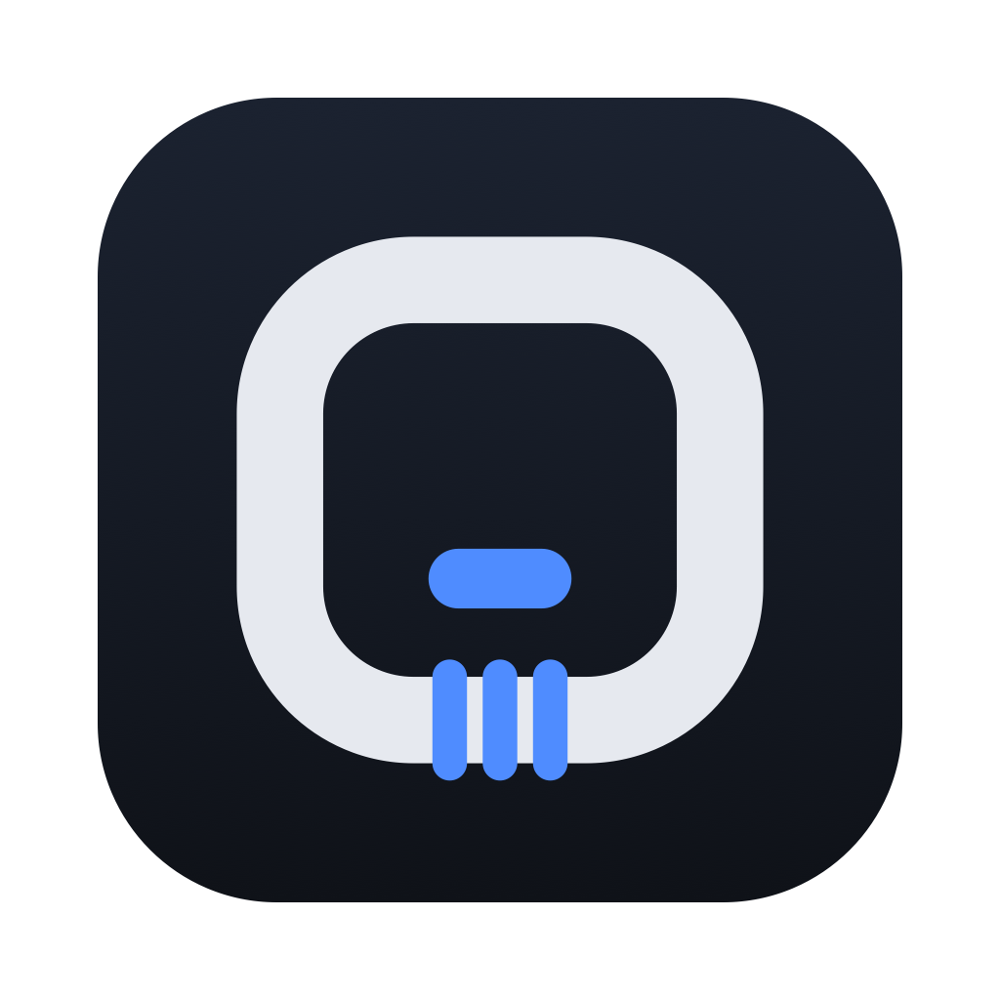
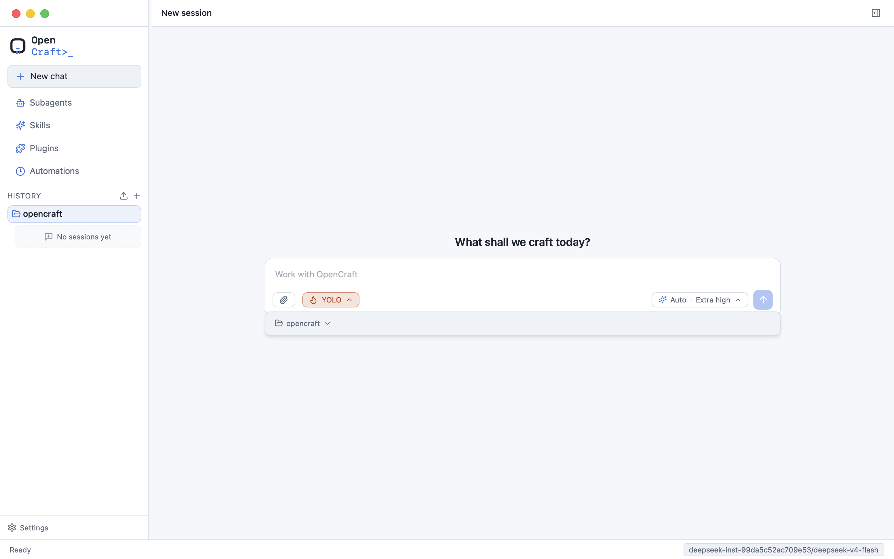

<p align="center">
  
</p>

<h1 align="center">opencraft</h1>

<p align="center">
  A local-first work partner built on
  <a href="https://github.com/GizClaw/flowcraft">flowcraft</a>.
</p>

<p align="center">
  <a href="https://github.com/GizClaw/opencraft/actions/workflows/ci.yml">
    
  </a>
  <a href="LICENSE">
    
  </a>
  
</p>

opencraft is a work partner that runs on your machine: it reads and edits
files, executes shell commands with approval, coordinates subagents, and
persists and resumes sessions. Built on flowcraft's config-driven graph
engine, it helps with coding and beyond — orchestrating any local workflow.
A local execd sandbox, SQLite session store, and per-project approval policy
keep everything inside a macOS / Linux / Windows desktop app (Wails v2 + React).

<p align="center">
  
</p>

## Features

- **Chat & sessions** — streaming reasoning, tool calls, and output blocks;
  interrupt and cancel; session resume, rename, export, and delete; kanban
  view of subagent delegation; i18n (English / 中文).
- **Inference** — one or more instances per provider (OpenAI, Anthropic,
  Azure, ByteDance, DeepSeek, Kimi, MiniMax, Qwen) with custom endpoints,
  router priority with retry fallback, and per-model usage trends.
- **Tools & safety** — file group, exec_command, exec_session (PTY),
  apply_patch, web_fetch, update_plan, request_permissions, and skill tools,
  protected by a middleware chain: truncation cache, 32k result cap, secret
  redaction, and a JSONL audit trail.
- **Runtime & sandbox** — local execd (stdio + unix socket, self-fork,
  parent-death cleanup), project-scoped SQLite store, buffer-fold memory
  summary, AGENTS.md worldstate, layered config, and seatbelt/bwrap sandbox
  with `.opencraft/approvals.yaml` approvals.
- **Multi-agent & skills** — persistent subagents with delegation kanban;
  skill discovery, git-based install, and authoring tools.
- **Workflow** — git context in the worldstate, turn-level undo/redo, JSONL
  session rollout stream, external lifecycle hooks, configurable network
  policy with a web_fetch SSRF gate, and a diagnostics tab.

## Installation

**Homebrew (macOS):**

```sh
brew tap GizClaw/opencraft https://github.com/GizClaw/opencraft.git
# Newer Homebrew versions require trusting the tap's cask once (security
# feature; run `brew trust gizclaw/opencraft` to trust the whole tap).
brew trust --cask gizclaw/opencraft/opencraft
brew install --cask opencraft
```

Or download the latest package from the
[Releases](https://github.com/GizClaw/opencraft/releases) page:

- `opencraft-<version>-macos-universal.dmg` — macOS (Apple Silicon + Intel)
- `opencraft-<version>-linux-amd64.tar.gz` — Linux (x86_64)
- `opencraft-<version>-windows-amd64.zip` — Windows (x86_64) portable build
- `opencraft-<version>-windows-amd64-installer.exe` — Windows (x86_64)
  NSIS installer

Windows binaries are not code-signed yet, so SmartScreen may warn on first
launch (More info → Run anyway), for both the portable exe and the installer.
Release binaries are built from tagged commits by the
[release workflow](.github/workflows/release.yml); the Homebrew cask lives in
this repository under [`Casks/`](Casks/). The macOS app is signed with a
Developer ID and notarized by Apple, so Gatekeeper opens it without the manual
"Open Anyway" step.

## Build from source

Prerequisites: Go 1.25.5+, Node 22, and the
[Wails v2 prerequisites](https://wails.io/docs/gettingstarted/installation)
for your platform.

```sh
make fmt lint test                          # fmt + lint + go test
make gen-bindings                           # regenerate frontend/wailsjs (generated, not committed)
wails dev                                   # run the desktop app (hot reload)
wails build -platform darwin/arm64          # package the macOS arm64 app
wails build -platform linux/amd64 -tags webkit2_41   # package the Linux app
wails build -platform windows/amd64         # package the Windows app
wails build -platform windows/amd64 -nsis   # also build the NSIS installer (requires NSIS)
```

`make build-linux`, `make build-windows`, and `make build-windows-installer`
wrap the corresponding Wails builds (the Windows binary cross-compiles from
any host; the installer needs `makensis`, e.g. `brew install nsis`).

`frontend/wailsjs` is generated by Wails and is not committed; `wails dev`
and `wails build` regenerate it automatically, and a frontend-only build
needs `make gen-bindings` first (CI does the same).

On first launch the desktop workbench guides you to the settings page when
inference is not configured yet. Settings are written to
`~/.opencraft/config/opencraft.yaml` — the single user-editable document for
inference instances, router policy, and MCP servers.

## Documentation

Release history is tracked in [CHANGELOG.md](CHANGELOG.md).

## Contributing

Contributions are welcome. Please open a pull request; the CI workflow
(fmt, lint, build, race tests, macOS/Linux/Windows packaging) and a review
are required before merging to `main`.

Maintainers release by tagging a version:

```sh
git tag v0.1.0
git push origin v0.1.0
```

The tag triggers the release workflow, which builds the packages, injects
the version into the binary via `-ldflags`, and publishes the GitHub
Release with notes from the changelog.

## License

Released under the [MIT License](LICENSE).
